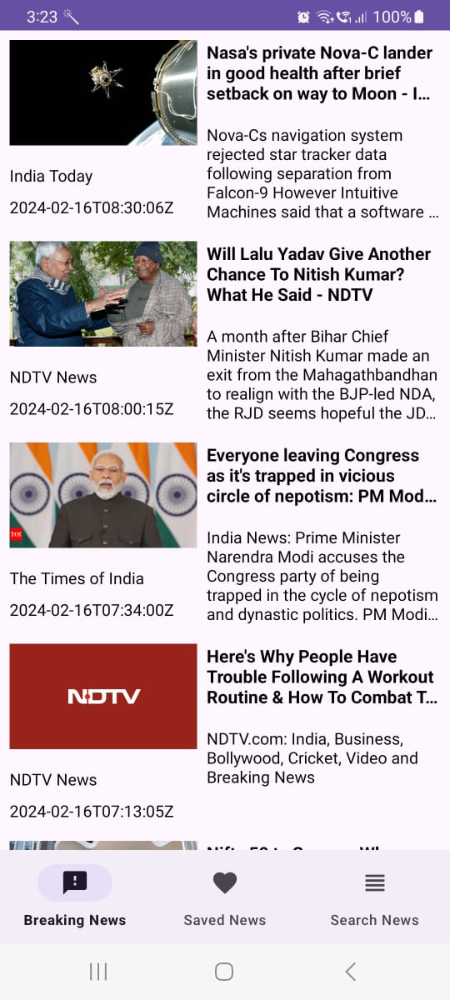
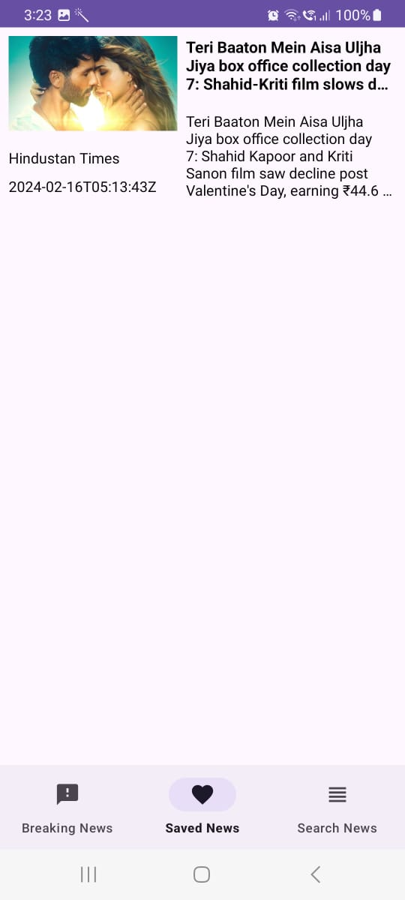
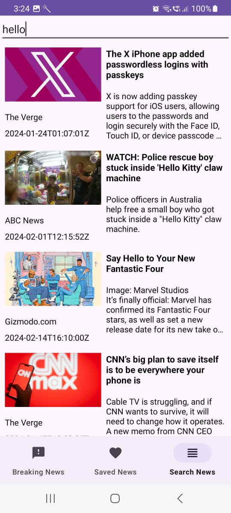
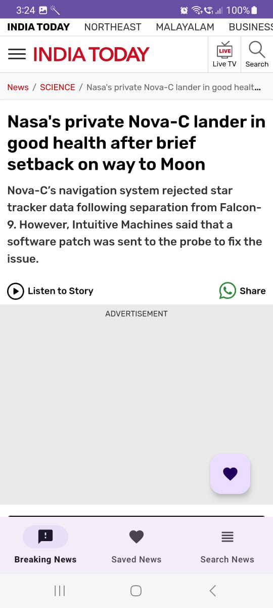

# News App

## Overview

This News App is built using the MVVM (Model-View-ViewModel) architecture, providing a clean and modular structure for managing and presenting news data. It leverages a third-party library [Name of the Library] for fetching and handling news articles.

## Features

- **MVVM Architecture**: The app follows the MVVM architecture, separating concerns and providing a clear structure for the codebase.

- **Third-party Library Integration**: Utilizes [Name of the Library] to efficiently fetch and manage news articles.

- **Responsive UI**: The app is designed to provide a responsive and user-friendly experience on various devices.

## Requirements

- Android Studio [Version]
- Kotlin [Version]

## Screenshots
<div align="center">
  
  
  
  
</div>


## Getting Started


### Installation

1. Clone the repository:

   ```bash
   https://github.com/ShiroyaShubham/News-App.git
